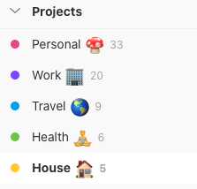
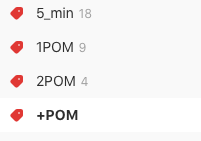
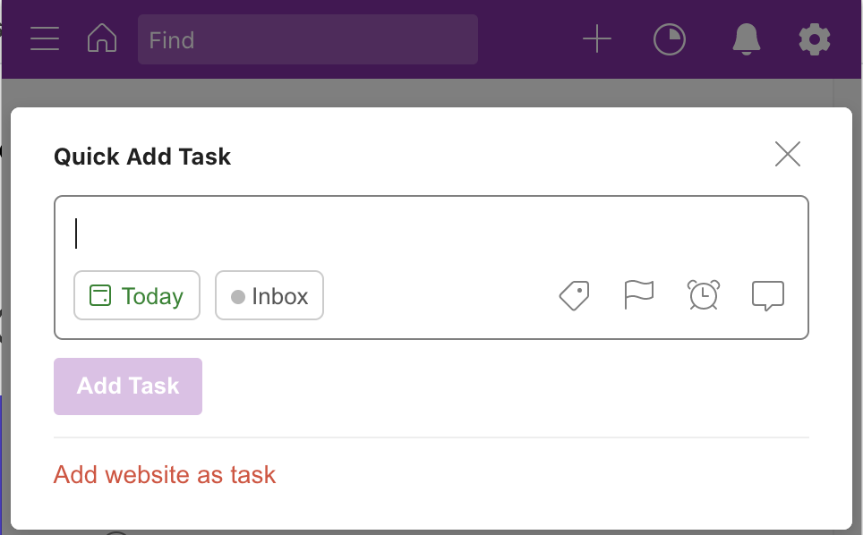

As a to do list user for multiple years, I've tried many different applications - [Remember the milk](https://www.rememberthemilk.com/), [Wunderlist](https://www.wunderlist.com/), [Habitica](https://habitica.com/static/home). After 4 years, I settled with one: [Todoist](https://todoist.com/). They build a great product that I use on a daily basis.

I want to share my todoist organization as it might help you. I use Todoist to track my personal and work tasks.

I like to keep the default inbox empty. I only use it to quickly dump ideas when I don't have time to add them to the correct project and move them across later. I tend to clean it up on a daily basis.

_Todoist also offers a flag system to prioritize tasks, I rarely use it so won't cover it here._

## Projects

I use the Todoist projects as 'areas' of life and for actual projects I use sub-folders inside.
I like to keep the high level hierarchy simple and relevant even if my life changes - new job or new house.

Inside these 'areas' I have sub-folders for each project. Most projects are limited in time and can be archived at some point. Some might live for a very long time (e.g this blog) while others will be archived within days or weeks. I typically don't have projects nested inside projects - too many steps to look inside.

## Labels

Labels are optional and not limited, very similar to hashtags in Instagram but typically less crazy. Most of my times are labelled.

My label system has evolved over time and I recently switched back to the very first system I started with - turns out I _was_ right first time!

Tasks are labelled based on either the **_time_** it takes to achieve them, or the **_action_** that needs to be taken. For more more aspirational tasks there is the _someday maybe_ tag.

### Time

I am a big fan of the [Pomodoro technique](https://francescocirillo.com/pages/pomodoro-technique) - [Pomodoro timer](http://www.tomatotimers.com/) so I tag my task in POMs (short for Pomodoro cycle).

- **5 min**: any task that can be achieved under 5 minutes, typically checking a refund you expect or printing a return label.
- **1 POM**: a task that can be achieved within one Pomodoro (30 minutes - 25 minutes work and 5 minutes break)
- **2 POM**: a task that can be achieved within two Pomodoros (60 minutes - 25 minutes \* 2 + two five-minute break)
- **\+ POM**: a task that requires more than 60 minutes.

### Action

Most of my tasks fall into 6 buckets. I am using Todoist to save links of articles I want to read - I tried [Pocket](https://getpocket.com/), [Instapaper](https://www.instapaper.com/u) but in the end always came back to Todoist.

- Email
- Phone
- Waiting: when I need to wait for someone in order to complete a task
- Read
- Write
- Research

Some example of tasks and how I would label them

- Email RE onboarding process @1_POM @write @email
- Refund Rei (\$50) @waiting
- Book dentist appointment @5_min @phone
- End of month budget review @1_POM
- Yearly goals review @2_POM
- Call grandma @phone

Blog post tasks example - adjusted depending on the post subject

- Blog post - Hoisting in JavaScript

  - Phase 1 @research @2_POM
  - Phase 2 @research @2_POM
  - Draft 1 @write @2_POM
  - Draft 2 @write @2_POM
  - Review @waiting
  - Final review @1_POM

- https://kentcdodds.com/blog/how-i-structure-express-apps/ @read
  Todoist allows you to easily save the link of an article for later retrieval. From Todoist browser extension, create a new task (shortcut Q) and click `Add website as task`.
  

## Filters

I like to keep filters fairly simple and separate work from personal life.

_Note that if you have emojis in your projects' names, you need to include them in your filters' queries._

### Personal

- Personal: everything excluding work and house: `##Personal 🍄 | ##Travel 🌎 | ##Health 🧘`
- No due date: `no date & !p:Work`
- Recurring: `recurring`

### Work

I have 3 filters to accommodate my workflow:

- All: `##Work 🏢`
- Next 5 days: `##Work 🏢 & 5 days`
- Work before a certain date - I work in cycles of 7 weeks so every new cycle I update the date of this query to reflect the next 7 weeks and quickly see what I need to achieve during this cycle: `##Work 🏢 & due before: July 31`

TODO talk about recurring tasks at work and template
TODO Talk about the possibility to favorite filters so they are acessible at the top of Todoist
